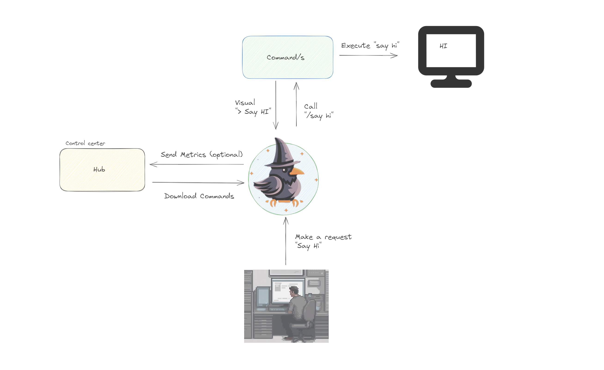

# Big Picture 🌐

Thanks to the high flexibility of the Rawen framework, it can be used in many different ways. See the instance as a robot that can be controlled by you.
Furthermore, the framework is designed to be highly scalable and can be used in many different ways, there are no limits in using all different kind of AI models or API endpoints.

## Desktop Application 🖥️

The central element of the Rawen command framework is the desktop application interface, which features a basic interface with specific routes:

1. Interaction Route (some will call it "chat").
2. Knowledge.
3. Settings.

All three components are highly adjustable and manipulable, making the framework dynamic and adaptable. For more details, visit the developers section.

## Commands 📜

Commands are the backbone of the Rawen framework and can be created in various ways. Rawen offers three solutions for this:

1. **SDK:** You can find the SDK [here](sdk-link) with a subset of functions to interact with and manipulate your instance.

2. **Inbound IDE:** Each instance includes an inbound Integrated Development Environment (IDE) that allows you to create and test commands lazily. All SDK functions are also available there.

3. **No-Code:** We've mapped some functions of the SDK pure selectable actions.
Also we are working on an assistant that guides you through the process of creating a command.

## Hub 🏢

### Private
A private rawen hub is a central element to monitor or restrict instances to use for a company or a group of people. It also serves as a central point to manage and distribute commands to the instances.

### Public
A public rawen hub is where people can share their commands with the community. 
Not only commands can be shared, but also knowledge and settings.