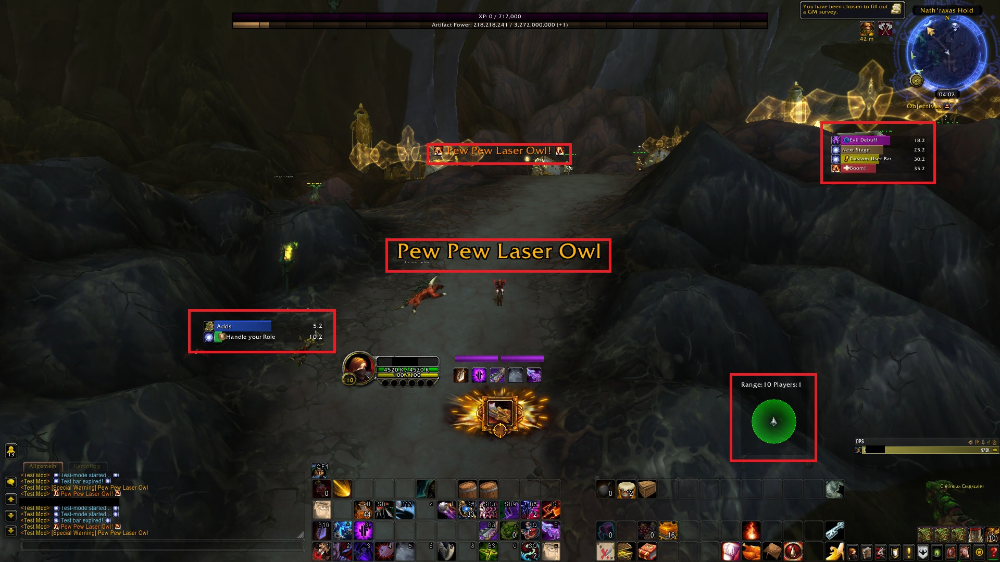

# Origin 🌟

## The idea 💡

The idea of a command framework emerged around 2021 with the goal of improving gaming experiences through an overlay app. This app provides information via API endpoints or vision-based information extraction (using OpenCV). Furthermore, it enables users to create shortcuts linked to intelligent commands, thereby enhancing the overall flow.

Additionally, it can take control of the user's keyboard and mouse, enabling actions such as clicking on specific texts or images and executing tasks through keyboard shortcuts.

`Inspired by addons like WoW`

<small>*cough* Cheats - Autotrainers *cough* </small>

But while the development progressed, I realized that this could be used for more than just gaming.

**"Why can't we have this for every other Application out there?"**
cause let's be honest, most of them are not really pretty and intuitive to use. People losing their time and nerves to get their work done by clicking through a bunch of menus and submenus to get to the desired result.

In 2022, the emergence of GPT and LLMS sparked new possibilities, and Rawen was integrated with these technologies, opening up exciting opportunities.

## The main goal 🎯
The main goal of Rawen is to offer a useful framework for everyone to shorthand processes and serving as a second layer app, copilot or assistant.

**OF COURSE** people are lazy and prefer a Instance that is already preconfigured and can do all kind of tasks on it's own and is able to learn new things. This is what we are working because we are lazy too.

<small> *cough* Bodysuit for a super intelligence that can do everything within your PC. *cough*</small>

